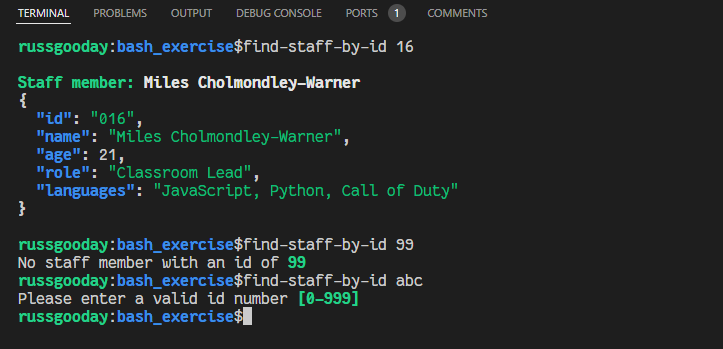

# Bash Scripting Exercises
### Working with the filesystem

This script will search the `staff` folder for a staff member with the given ID and return the staff member's details.

### Setup

First run the setup.sh script. To allow the script to add a local `bin` directory to your `PATH` variable, you will need to run the script with the `source` command.

This will allow the script to modify the `PATH` variable of the current shell session and enable you to run the scripts locally without having to specify the full path to the script.
e.g. `find-staff-by-id 002` instead of `./bin/find-staff-by-id 002`.

The script will also install the `jq` command line tool which is used to parse JSON files. For more info on `jq` see: https://stedolan.github.io/jq/

**Run setup from bash**
```bash
source setup.sh
```

### What I learnt

I deviated somewhat from the initial brief for this project. I wanted to expand on my basic knowledge of `bash` and get a better understanding of it's commands and implementations.

Here are some of the things I learnt:

- **Working with functions:**
  * Using local variables to avoid polluting the global namespace.
  * Understanding how to pass arguments to functions and how to use/expand those arguments.
  * Understanding how to return something useful (strings).
  * Utilising functions to modularise the code into smaller single purpose functions.

- **Working with strings:**
  * This has been a big part of the learning exercise. Familiarising myself with string substitution, concatenation, formatting, padding and adding colours to the output.

- **Working with jq:**
  * Learning how to prepend a property onto an existing JSON object using `'{x:y} + .'`
  * Learning how to pass in a value using --arg `--arg id $id`
  * Learning how to convert an array property to a comma separated string with join `.languages |= join(", ")`.
  * Learning how to use jq in combination with string substitutions and output in colour.

- **Validation:**
  * Using regexes for simple validation of arguments
  * Learning about the `-n` and `-z` flags for dealing with empty strings.

### Running the `find-staff-by-id` script

This is a very simple script. You run the script passing in one argument, a number in the range **1-999**

```bash
find-staff-by-id 2
```

The number passed in will be padded to a 3 digit number so as to match with the existing files e.g. `2` becomes `002`

If no staff member exists with the given number a message will be returned. If nonsence is passed in e.g. `abc` an error message will be outputted and the script exits.

If a successful match is found the name of the staff member and their details will be outputted.

#### Example

Using the following staff member's json source file as an example.


**Terminal**
```bash
find-staff-by-id 16
```



### Running the `find-files-or-directories` script

This script will search for a given folder or filename and return the found file or folder and it's contents.


**Terminal**
```bash
find-files-or-directories
Enter name of file or directory: # enter folder or file name
```

#### Example

**Terminal**
```bash
find-files-or-directories
Enter name of file or directory: 10.jpeg

find-files-or-directories
Enter name of file or directory: filesystem/staff
```

