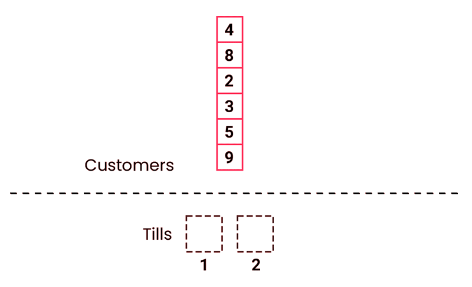
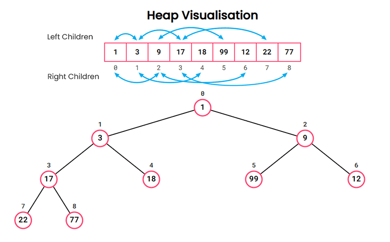
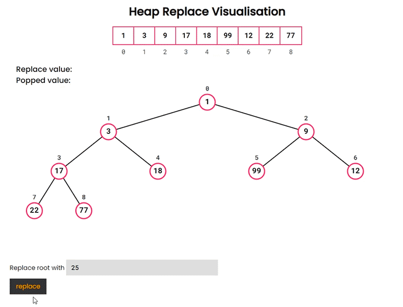

# Supermarket Queue
You are a middle manager in a large supermarket chain, tasked with overseeing the checkout queue.

Every once in a while, your boss radios you to ask how long the current queues will take to process. You take this job seriously, so you've decided to write a function called queue_time to solve the problem.

The function takes two arguments:

- **customers**: a list of positive integers representing the queue. Each integer represents a customer, and its value is the amount of time they require to check out.
- **checkouts**: a positive integer, the number of checkout tills.

The function should return the time required to process all the customers.

- There is only ONE queue.
- The order of the queue NEVER changes.
- Assume that the front person in the queue (i.e. the first element in the list) proceeds to a till as soon as it becomes free.
## Examples:
```
queue_time([2, 2, 2], 1)
# returns 6 because just one checkout means the total time is just the sum of the times

queue_time([2, 10], 2)
# returns 10 because each customer has immediate access to a checkout and the slowest customer is 10

queue_time([2, 2, 2], 2)
# returns 4 because the first 2 customers have immediate access to a checkout, and then one customer is left to be processed

queue_time([2, 3, 10], 2)
# returns 12, because the first checkout will deal with the 2 minute customer, and then the 10 minute customer - totalling 12 minutes
```

## How I approached this exercise

### Method:

To calculate the time required to process all customers, we can use a simple approach. Each checkout till will maintain a running total of the time taken to serve its customers. The next customer in the queue will always go to the till with the current lowest total time.

Once all customers have been served, the total time required will be held in the till with the maximum value.

**A simple example with 2 tills and 6 customers.**



### A min-max solution:

Using a loop, the built-in `min` and `max` methods can be used to perform the necessary calculations.

```python
# create a list of tills with initial times set to zero
tills = [0] * num_tills

for t in queue:
    # find the index of the till with the lowest time
    # and add to that the time of the current customer(t)
    tills[tills.index(min(tills))] += t

# return the till with the maximum value
return max(tills)
```

### An alternative approach using heap queue

An alternative to using the built-in `min` method is to use Python's [heapq](https://docs.python.org/3/library/heapq.html) module. This module implements a heap queue, also known as a priority queue, which is an efficient way to keep track of the smallest (or largest) item in a collection.

In a min heap, the smallest element is always at the root, and each parent node is smaller than its child nodes. This property allows for efficient insertion and extraction of the smallest element.

The heap is stored as a list, and the relationships between parent and child nodes are determined by simple index calculations:

```
left_child = i * 2 + 1
right_child = i * 2 + 2
parent = (i - 1) / 2
```



### Example of heapreplace

The following example demonstrates the `heapreplace` function. The root node is popped and replaced with the new value. Starting from the root, the tree is then restructured to maintain the min-heap property.

The time complexity for adding and removing elements is logarithmic, making it more efficient for larger queues than using `min` and `max`.



### Custom heap module (Python)

Driven by curiosity and a desire to deepen my understanding of the heap algorithm, I explored the topic further — my new copy of Introduction to Algorithms (Fourth Edition) proved especially helpful.

I started by implementing the algorithm in Python.

```python
def left_child(i:int) -> int:
    ''' returns the index of the left child of the node '''
    return (i << 1) + 1

def right_child(i:int) -> int:
    ''' returns the index of the right child of the node '''
    return (i << 1) + 2

def get_parent(i:int) -> int:
    ''' returns the index of the node's parent '''
    return i - 1 >> 1


def min_heapify(heap: list, pos:int) -> list:
    ''' reorganises the a nodes from a given index so that they maintain the heap property '''
    heap_size = len(heap)
    parent = pos
    # move pos to left-child
    pos = left_child(pos)

    while pos < heap_size:
        right_pos = pos + 1

        # if right-child has a value smaller than or equal to left-child
        if right_pos < heap_size and heap[right_pos] <= heap[pos]:
            # move pos to right-child
            pos = right_pos

        if heap[pos] < heap[parent]:
            heap[pos], heap[parent] = heap[parent], heap[pos]
            parent = pos
            pos = left_child(pos)
            continue
        break

def heapify(lst: list) -> list:
    '''Reorganizes the nodes so that they maintain the heap property.'''
    for i in range(get_parent(len(lst)), -1, -1):
        min_heapify(lst, i)
    return lst

def heap_replace(lst: list, val: int) -> int:
    ''' 
    Returns the smallest item in the list, replacing it with a given value and
    restores the heap property by moving the new value to the correct position.  
    '''
    smallest = lst[0]
    lst[0] = val
    min_heapify(lst, 0)
    return smallest
```

The amended solution using the custom heap module looked like this:

```python
# given we are starting with a list of zeros
# there is no need to heapify the list
tills = [0] * num_tills
max_value = 0

for t in queue:
    # add the time of the current customer to 
    # the till with the lowest time
    t += tills[0]
    if t > max_value:
        # update the max_value if the current customer's time is greater
        max_value = t
    # replace the smallest value in the heap with the current customer's time
    # and reorganise the heap
    heap_replace(tills, t)

return max_value
```

Unfortunately in my tests, given that the built-in [`min` and `max`](https://github.com/python/cpython/blob/main/Python/bltinmodule.c#L1796) functions are written in C, the python heap implementation was fractionally slower.

### C and CPython heap modules

Disappointed with the results and curious to explore the potential performance improvements of a C implementation, I decided to give it a try. Since I had never programmed in C before, this was truly uncharted territory for me.

Implementing a pure C version turned out to be fairly straightforward:
```c
// Initial heap implementation written in pure C
#include <stdio.h>

#define left_child(i) ((i << 1) + 1);
#define parent_of(i) ((i - 1) >> 1);
#define len(x) sizeof(x) / sizeof(x[0]);


void swap(int heap[], size_t x, size_t y) {
    int temp = heap[x];
    heap[x] = heap[y];
    heap[y] = temp;
}


void min_heapify(int heap[], size_t heap_size, size_t pos) {
    size_t parent = pos;
    pos = left_child(pos);

    while (pos < heap_size) {
        size_t right_pos = pos + 1;
        // if right-child has a value smaller than or equal to left-child
        if (right_pos < heap_size && heap[right_pos] <= heap[pos]) {
            // move pos to right-child
            pos = right_pos;
        }

        if (heap[pos] < heap[parent]) {
            swap(heap, pos, parent);
            parent = pos;
            pos = left_child(pos);
            continue;
        }
        break;
    }
}


int heap_replace(int heap[], size_t heap_size, int val) {
    // returns the smallest item in the list, replacing it with a given value
    int smallest = heap[0];
    heap[0] = val;
    min_heapify(heap, heap_size, 0);
    return smallest;
}


void heapify(int heap[], size_t heap_size) {
    // reorganises the a nodes so that they maintain the heap property
    size_t i = 1 + parent_of(heap_size);
    for (; i-- > 0;) {
        min_heapify(heap, heap_size, i);
    }
}
```

To actually make a usable module for Python, I had to learn about the [CPython API](https://docs.python.org/3/c-api/index.html). The API allows you to write Python modules in C, and it provides a way to interact with Python objects and the Python runtime.

It was a steep learning curve, of which I only scratched the surface. I confess I ended up doing a lot cross referencing between heapq's C implementation and the CPython documentation. Learning about PyObjects, error handling, reference handling and the various methods to interact with Python objects was a lot to take in.

The final implementation can be found in the [heapify.c](src/internals/lib/_heapify.c) file.

Having looked through Python's built in modules I am aware that my code is somewhat naieve. That said with the brief tests I did, the CPython module was considerably faster than the built-in `min` and `max`.

### Conclusion

This exercise was a great learning experience. I was able to explore the heap algorithm in depth, and I gained a better understanding of how Python's built-in functions work under the hood. I also learned about the CPython API and how to write Python modules in C.

In practice, it would be best to use the built-in `min` and `max` or `heapq` functions for this particular problem. However, the custom heap module and the CPython module were fun to implement and provided valuable insights into the inner workings of Python.